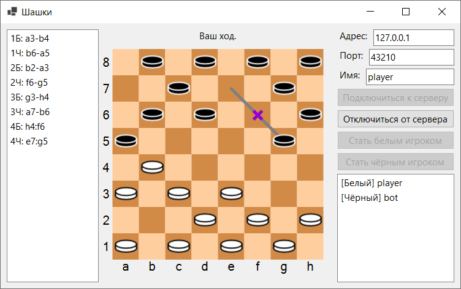

Курсовая работа "Реализация и сравнение алгоритмов поиска в дереве позиций игры". В данной работе реализовано клиент-серверное приложение для игры в шашки, позволяющее играть людям и ботам. Текст курсовой находится в файле `coursework.pdf`, презентация -- в `presentation.pdf`.

Проект состоит из:
- общей библиотеки `CheckersLib`;
- клиента с графическим интерфейсом `CheckersClient`;
- сервера игры `CheckersServer`;
- клиента-бота `CheckersBot`;
- `CheckersBotTest` -- небольшой программы для сравнения ботов.

Реализованные боты:
1. `random` -- выбирает случайный ход;
2. `miniMaxWeak` -- использует алгоритм минимакс и первую оценочную функцию;
3. `miniMax` -- то же, но использует вторую оценочную функцию;
4. `alphaBeta` -- использует альфа-бета отсечение;
5. `negaScout` -- использует алгоритм NegaScout;
6. `negaScoutTransposition` -- использует таблицу транспозиций.